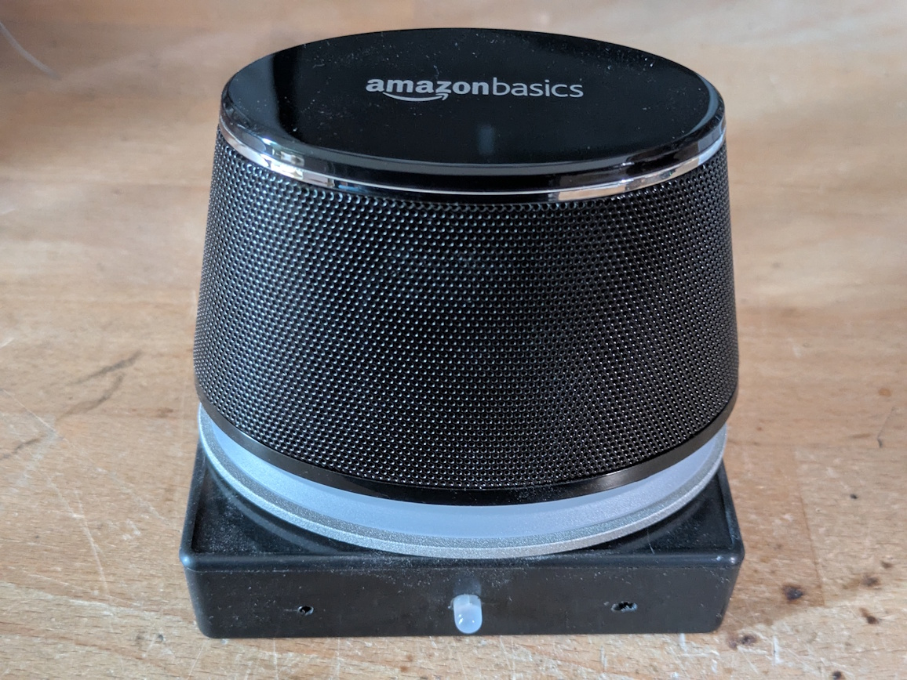
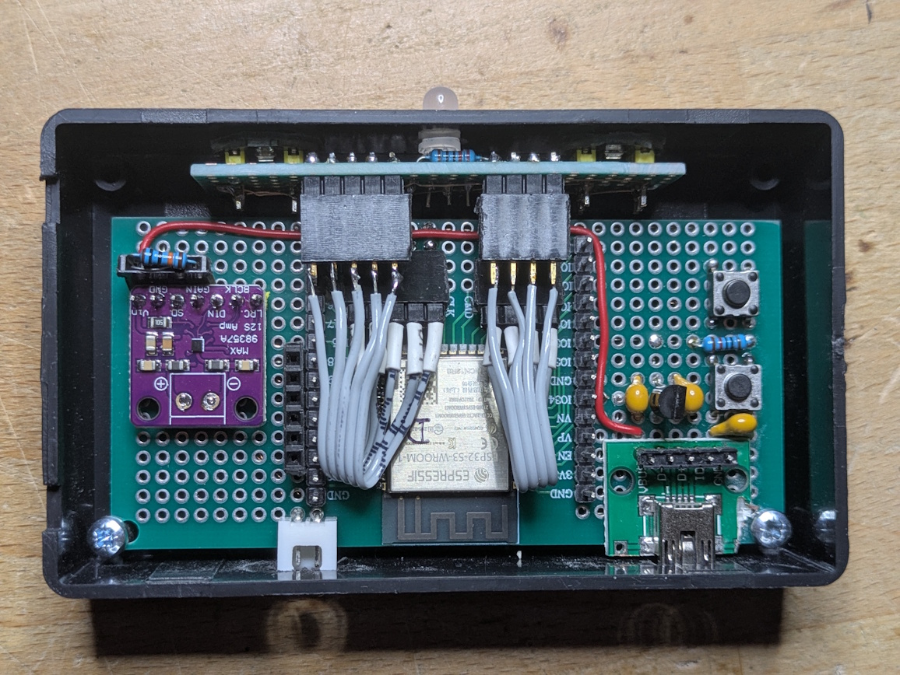
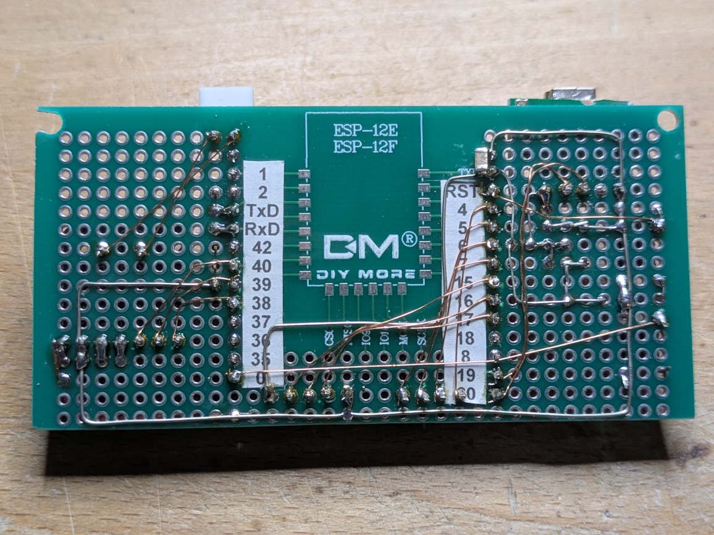
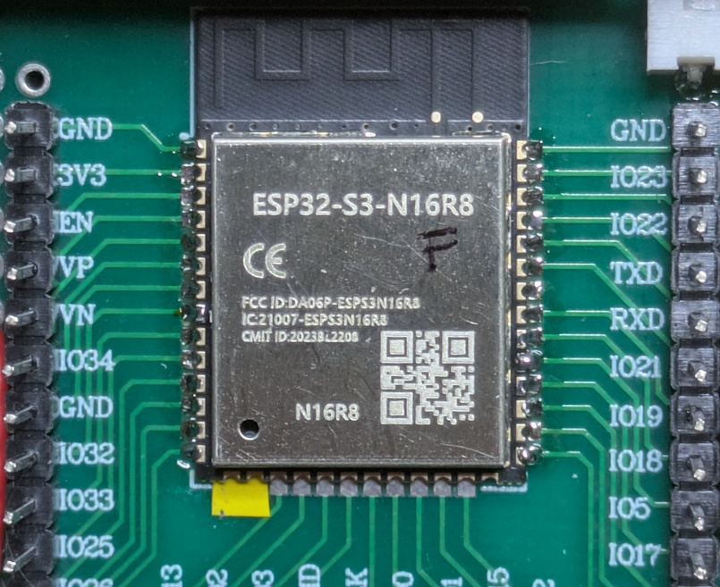
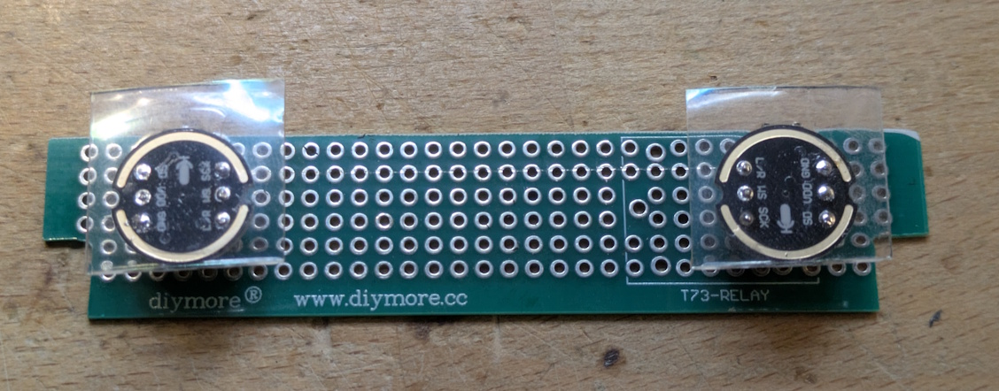
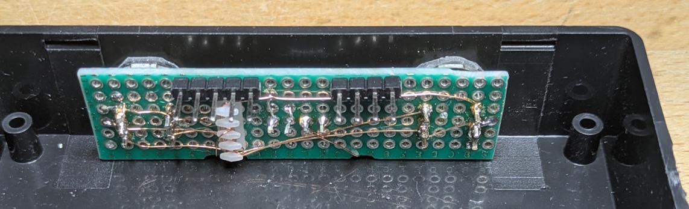
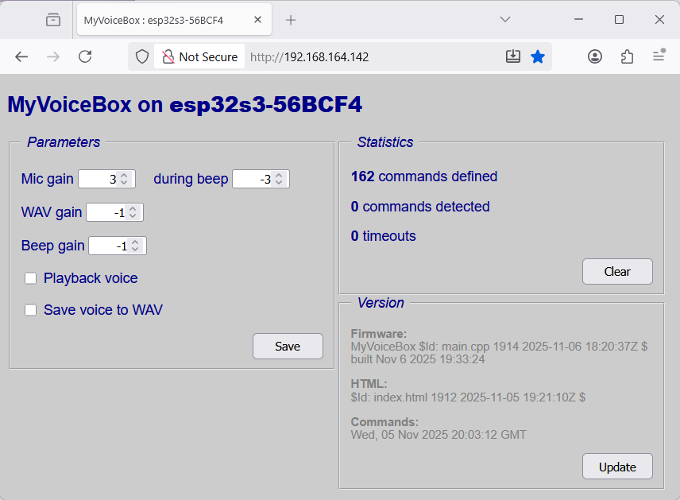

# Cloud-free voice control for OpenHAB
----
- [Objective](#objective)
- [Key features](#key-features)
- [Bird's eye view of the solution](#birds-eye-view-of-the-solution)
- [Hardware](#hardware)
- [Build instructions](#build-instructions)
  - [Prerequisites](#prerequisites)
  - [Hardware](#hardware-1)
  - [Mechanical construction](#mechanical-construction)
  - [Firmware](#firmware)
  - [OpenHAB integration](#openhab-integration)
  - [Rhasspy integration](#rhasspy-integration)
- [Web interface](#web-interface)
- [Technical considerations](#technical-considerations)
  - [Microphone](#microphone)
  - [Attenuating the speaker signal](#attenuating-the-speaker-signal)
  - [Design alternatives](#design-alternatives)
    - [OpenHAB STT instead of Rhasspy](#openhab-stt-instead-of-rhasspy)
    - [Other speech recognition models](#other-speech-recognition-models)
- [Insights](#insights)
  - [Using Espressif speech recognition in an Arduino project](#using-espressif-speech-recognition-in-an-arduino-project)
  - [Acoustic "debugging"](#acoustic-debugging)
  - [How Rhasspy communicates with satellites](#how-rhasspy-communicates-with-satellites)
- [Alternatives](#alternatives)
- [References](#references)
- [License](#license)

## Objective

I wanted a few small units for speech-to-text (voice recognition) and text-to-speech (voice output) for my home automation environment, which includes OpenHAB and Rhasspy (details [here](https://requireiot.com/listen-voice-interaction-with-home-automation/)).

Previously, I have used [Rhasspy](https://rhasspy.readthedocs.io/en/latest/) satellites built with a Raspberry Pi and a small speaker (described [here](https://requireiot.com/rhasspy-satellite-with-raspberry-pi/)), but now I wanted something simpler and more compact, and with the voice recognition happening in the satellite device itself, without streaming audio to a server, not even to an in-house server. 

Espressif offers a ready-made speech recognition component for their ESP32-S3 processors called `esp-sr`, which can also be used in an Arduino project ... sort of, see below for the nasty details. 

The *advantages* of using `esp-sr` over a Raspberry Pi based satellite are 
* the speech recognition happens on the local processor, so there is no need to stream raw audio over WiFi to a central Rhasspy server.
* it includes some advanced signal processing, like noise reduction and blind source separation when using two microphones.

The *disadvantages* of using `esp-sr` versus Rhasspy are
* it can only detect fixed text, like "*turn on the lamp*", but not text with variable numbers, like "*dim the lamp to 50 percent*" -- not an issue for me, in most use cases.
* it only does speech-to-text (voice recognition) and not text-to-speech (voice synthesis) ... unless you understand Chinese -- you have to use a separate service for that, like Rhasspy or a standalone TTS service.
* it only supports English and Chinese, whereare Rhasspy can be configured for many different languages -- I'm ok with English, but YMMV.

The plan was to package the ESP32-S3 module with a small speaker, and write software that integrates with my existing home automation environment.

## Key features

- **low cost**:a small device based on an ESP32-S3, total cost of materials ca. €20
- **privacy**: self-contained speech recognition in the device, no audio streaming to a server
- **dynamic**: automatic configuration for voice-controlled items defined in OpenHAB 

## Bird's eye view of the solution

* a Python script occasionally runs on a server, queries OpenHAB for all voice-controlled items, builds phrases such as "*turn on kitchen lamp*" and "*turn off kitchen lamp*", converts them to phonemes to be fed to the `esp-sr` library, and stores all information in a file on a server. 
* a small ESP32-S3 module running my software and the Espressif `esp-sr` speech recognition library retrieves the phrases file from the server, initializes the library, and then listens to voice commands.
* when the ESP32-S3 module detects a voice command, it publishes a message to MQTT, in essentially the same format that a Rhasspy satellite would produce. Therefore, I only need *one* OpenHAB rule to deal with commands from the new ESP32-S3 module, or an existing Rhasspy satellite.
* for voice synthesis, I use the Rhasspy text-to-speech engine, the ESP32-S3 module just receives a WAV file from Rhasspy (via MQTT) and plays that on its speaker.

## Hardware



I developed this project using a cheap ESP32-S3 dev module from Aliexpress, a clone of the Espressif ESP32-S3-DevKitC1-N16R6. This has 16MB flash, 8 MB PSRAM, and a Neopixel-esque RGB LED on board.

A MAX98357A I2S digital amplifier module is connected to I2S interface #0 and drives the speaker.

Two INMP441 I2S digital microphones module are connected to I2S interface #1.

An analog RGB LED serves as a status indicator: "waiting for wakeword", "recognized wakeword and waiting for command", "recognized command", or "timeout".

## Build instructions

### Prerequisites

You will need
* a working installation of **OpenHAB**, to receive and interpret the commands recognized by MyVoiceBox. I currently use OpenHAB 4.1.1, running under Debian on a virtual x86 machine.
* a working installation of **Rhasspy**, configured for a TTS engine of your choice. I use Rhasspy 2.5.11, running under Debian on a virtual x86 machine, with the *Larynx* test-to-speech engine and the *blizzard_lessac* voice.
* an **HTTP** server that can serve files to MyVoiceBox. I use Apache 2.4.65 running under Debian on a virtual x86 machine.

### Hardware

 

Follow the [schematic](hardware/MyVoiceBox.pdf) to build the hardware. For production units, I used a "bare" ESP32-S3-WROOM-1 N16R8 on a prototype board that has a footprint for an ESP32 module ... the pinout is similar enough so I could place the ESP32-**S3** module on the footprint intended for a "plain" ESP32. Ignore the labels on the board, the pinout of an ESP32-S3 is different from an ESP, except the GND, 3v3, TxD and RxD signals, which are on the same pins for both modules. 


Put a piece of insulating tape over the pin in the bottom left corner of the protoboard footprint -- this is GND on the ESP32, but a stzrapping pin signal on the ESP32-S3.

For a speaker, I use half of a pair of "*Amazon Basics Stereo 2.0 Speakers for PC or Laptop*". They are cheap (typically under €20 per pair), and the sound quality is quite good, for this type of application.

### Mechanical construction

I used a 100x60x25mm plastic box for the project. Here is how I placed the microphones:
- solder the pin headers to the INMP441 microphone module such that the tip of the pins are flush with the surface of the module PCB on the side away from the components.
- place the microphones on a piece of perf board, with the microphone holes ca. 5cm apart
- drill two 2mm holes in the side of the plastic box, with a distance in between that is the distance between the microphone holes
- place a piece of thick (1mm) double-sided sticky tape over each microphone module, and cut out a small hole over each microphone hole 

- align the perf-board and microphones assembly over the holes in the plastic box, and glue it to the plactic box

### Firmware

1. Clone the Github repository.
2. Copy `main/myauth_sample.h`to `main/myauth.h` and edit that to define your WiFi SSID and password, as well as the names of the servers in your home environment.
3. In folder `tools/`, edit `oh_sr_commands.py` to set the name of your OpenHAB server, then run `python oh_sr_commands.py`. This creates file `data/oh_sr_commands.csv`, copy that to your HTTP server. This is where the MyVoiceBox firmware will get its information about voice-related OpenHAB items. 
4. Build firmware and upload to your ESP32-S3 module, over USB.
5. Future updates can also be done over-the-air. Edit `ota-update.bat` to set the IP address of your device, then run it.

### OpenHAB integration

* for all OpenHAB *items* to be voice controlled, the item label is the name used in the voice command
* all OpenHAB *items* that can be **switched** on and off are assigned to group `gVA`. This creates voice commands "*turn on `label`*" and "*turn off `label`*".
* all OpenHAB *items* that can be **dimmed** are assigned to group `gVD`. This creates voice commands "*dim `label` to low|medium|high|off*".
* all OpenHAB *items* that represent lighting **scenes** are assigned to group `gVS`. This create voice commands "*let's `scene label`".
* all OpenHAB items that can be asked about are assigned to group `gVQ`. This creates commands "*what is the `label`*"

So my OpenHAB items definition file `/etc/openhab/items/voice.items` file might look like this
```
 Switch KitchenLight    "kitchen light"        (gVA) { ... some binding ... }
 Number BedsideLampDim  "bedside lamp"         (gVD) { ... some binding ... }
 Switch sceneTV         "watch TV"             (gVS) // dummy switch watched by a rule
 Number localTemp       "temperature [%.0f°C]" (gVQ) { ... some binding ... }
```

See [openhab/myvoicebox.things](openhab/myvoicebox.things) and [openhab/myvoicebox.items](openhab/myvoicebox.items) for examples of things and items definitions needed for the integration, and [openhab/myvoicebox.rules](openhab/myvoicebox.rules) for examples of rules that respond to incoming MQTT messages for each type of voice command.

Note that this is not a complete OpenHAB configuration, just snippets to illustrate how OpenHAB has to be configured.

### Rhasspy integration

Since we use Rhasspy to generate the audio signal for spoken voice messages, the ESP32-S3 based "satellites" must be known to Rhasspy. Browse to your Rhasspy web configuration page at `http://some-server:12101/settings`, drop down the `Text to Speech` area, select your favorite Voice, and in the `Satellite siteIds:` field, add the hostname of each MyVoiceBox module. Mine looks like this
```
Satellite siteIds: raspi13,raspi14,esp32s3-56BCF4,esp32s3-56BCFC
```
For more details about my integration of "real" Rhasspy satellites with OpenHAB, see my [blog](https://requireiot.com/rhasspy-with-openhab/).

## Web interface



A simple web frontend assists with troubleshooting. It lets you tweak some operating parameters:
- **Mic gain** is the amplification applied to the microphone signals while waiting for the wakeword, or while waiting for a command. This is specified in steps of 6 dB, so 1=6dB, 2=12dB etc.
- Mic gain **during beep** can be lower, to attenuate the beep feeding back into the microphones. I have tzhis set to -3 (18 dB attenuation).
- **WAV gain** is the gain applied to WAV files received via MQTT, i.e. spoken messages
- **Beep gain** is the gain applied to internal beeps
- checking **playback voice** enables replaying the microphone signal immediately after a command has been detected, or timeout occured. This can help to spot audio quality issues.
- checking **save voice to WAV** will record the voice signal while a command is being spoken, and upload it as a WAV file to an external FTP server. This can help to spot audio quality issues. You must have the name of your FTP server defined in [main/myauth.h](main/myauth.h).

Click the `Save` button after you have made any changes here.

The top right panel shows some simple statistics: how many voice commands were uploaded at startup, and how many times was a command successfully recognized, or did a timeout occur? Click the `Clear` button to reset the counters.

The bottom right panel gives some information about the current version of the firmware, the HTML file that creates the web interface, and the CSV file that was used to import voice command definitions. Click the `Update` button to download the HTML and CSV files from the external server again. You must have the URL of your HTTP server defined in [main/myauth.h](main/myauth.h) for this to work.

## Technical considerations

### Microphone

I use INMP441 digital microphones, with the following characteristics:
- sensitivity (per datasheet): -26 dBFS for 94 dB SPL, i.e. 120 dB SPL at full scale
- 24 bit data size, sent as 32 bit words

I don't expect input signals beyond 100 dB SPL, or -20dB FS, so we can amplify 
the 24-bit word by 18 dB (3x left shift), and then use the top 16 bits. If we consider the upper 16 bits only, then the theoretical noise floor is -96 dB FS or **24** dB SPL, which is well below the actual ambient noise floor in a quiet room.
The INMP441 datasheet specifies a noise floor of -87 db FS (A-weighed), or an EIN of **33** dB SPL(A).

If we just consider the top 16 bits, and then amplify by 18 dB, we only get bits 15:3, and bits 2:0 are always zero. That is in effect a 13-bit ADC with full scale at 102 dB SPL and a noise floor at 102-6*13 = 24 dB SPL, good enough.

### Attenuating the speaker signal

The ESP-SR library affords feeding the speaker output back into the input, as a third channel, to minimize feedback from the speaker back into the microphones. I implemented the poor man's version of that: as long as a signal is being played through the speaker, the microphone signals are attenuated. The level of attenuation is configurable in the web interface.

### Design alternatives

#### OpenHAB STT instead of Rhasspy

Instead of using Rhasspy for text-to-speech functionality, one could use the STT functions built into OpenHAB, have it generate a WAV file and send that to the MyVoiceBox device. I already had Rhasspy up and running, so I didn't pursue that route

#### Other speech recognition models

The firmware currently uses Multinet5, an older speech recognition model provided by Espressif. They also have the newer Multinet7 model, which is supposedly more accurate. I tried it, and actually found it to be *less* accurate, maybe I did something wrong there.

## Insights

### Using Espressif speech recognition in an Arduino project

I wanted to write an Arduino project, using the Espressif `esp-sr` component for 
speech recognition, wrapped in the `ESP_SR` Arduino library.

However ... in an *Arduino* project, the wakeword is fixed as "Hi,ESP", and cannot be changed, because the ESP libraries are precompiled for this particular configuration. I tried the real Arduino IDE as well as Arduino CLI, VSCode with the ["Arduino Community Edition" extension](https://github.com/vscode-arduino/vscode-arduino), and VSCode with Platformio, all with the same result.

Therefore, this is an ESP-IDF project with "Arduino as a component". I use VSCode with the ESP-IDF extension. 

In the ESP-IDF project, one of several wakewords can be selected through the project configuration tool. The original `ESP_SR` Arduino library (at least for Core 3.3.0) also has the wakeword "Hi, ESP" hardcoded, so I had to clone that library and make my changes. The cloned library is called `ESP_SRx` and can be found in the `components/ESP_SRx` folder.

### Acoustic "debugging"

I found it really helpful to be able to listen to the audio signal picked up by the microphone and sent to the speech recognition engine. There are two features, which can be enabled via the web interface:
- record the audio signal while a command is being spoken, and save it to a WAV file on an external server
- record the audio signal while a command is being spoken, and replay it through the speaker immediately afterwards

These help to address issues like: is there too much echo from the room? is the signal contaminated with electrical noise?

### How Rhasspy communicates with satellites

The MyVoiceBox device simulates a Rhasspy satellite to the extent necessary for working with my OpenHAB installation, so I had to do a bit of reseearch on how Rhasspy communicates with its satellites.

To create audio output on the satellite, Rhasspy publishes am MQTT message to `hermes/audioServer/<siteId>/playBytes/<sessionId>`. A message to my satellite named `esp32s3-56BCF4` would go to a topic like `hermes/audioServer/esp32s3-56BCF4/playBytes/226f9057-1360-4927-a786-8fcf8d6a997b`. The payload of the message is the complete WAV file to be played.

When the satellite has finished playing back the WAV file, it will publish a message to `hermes/audioServer/<siteId>/playFinished`. The payload is a JSON formatted string that contains the sessionId from the previous message. So my satellite would respond to the example message above with a payload of `{"id": "226f9057-1360-4927-a786-8fcf8d6a997b", "sessionId": "226f9057-1360-4927-a786-8fcf8d6a997b"}`.

## Alternatives

I am aware of the following possible alternatives to my project, with similar objectives and features:

* a **Raspberry Pi based Rhasspy satellite**, as described [here](https://requireiot.com/rhasspy-satellite-with-raspberry-pi/). It works, but requires more power, and audio is streamed over WiFi for speech recognition at a central in-home server.
* the **[ESP32 Rhasspy Satellite](https://github.com/Romkabouter/ESP32-Rhasspy-Satellite)** project. It uses a "regular" ESP32. I built one, see my [blog post](https://requireiot.com/basic-satellite/). I used it for output only, because for voice recognition, it requires constant streaming of the audio signal to a central server. Even the wakeword detection is done on the server.
* the **[Willow](https://heywillow.io/)** project, which also runs on an ESP32-S3 and can use the speech recognition library provided by Espressif. It is a sophisticated open-source project, but its focus appears to be on working with a central in-home server, which they call the "inference server". Also, it doesn't have voice output, as far as I can tell. The required hardware is from a small list of devices sold by Espressif, which they call "cheap" at $50 ... still more than the ~ €20 hardware cost of MyVoiceBox.

## References

- INMP441 digital microphone [datasheet](https://invensense.tdk.com/wp-content/uploads/2015/02/INMP441.pdf)
- MAX98357A I2S PCM class D amplifier [datasheet](https://www.analog.com/media/en/technical-documentation/data-sheets/max98357a-max98357b.pdf)

## License

The code and schematics I created for this project are under an MIT license, see [LICENSE.txt](LICENSE.txt). Folder `components/` contains libraries cloned from other repositories, which may be under a different license, see each folder for more details.